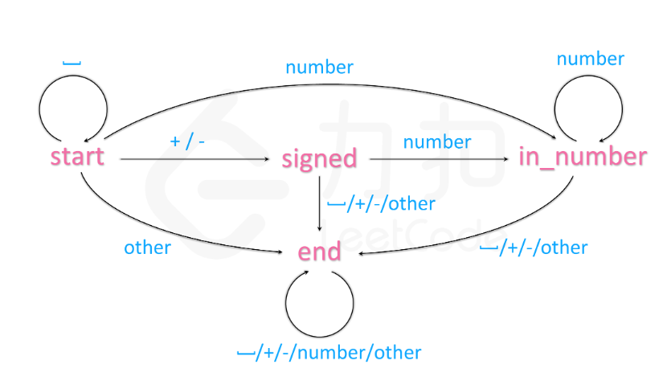

# 4.3 T8字符串转换整数(atoi)

## 题目描述
请你来实现一个 atoi 函数，使其能将字符串转换成整数。

首先，该函数会根据需要丢弃无用的开头空格字符，直到寻找到第一个非空格的字符为止。接下来的转化规则如下：

- 如果第一个非空字符为正或者负号时，则将该符号与之后面尽可能多的连续数字字符组合起来，形成一个有符号整数。
- 假如第一个非空字符是数字，则直接将其与之后连续的数字字符组合起来，形成一个整数。
- 该字符串在有效的整数部分之后也可能会存在多余的字符，那么这些字符可以被忽略，它们对函数不应该造成影响。

注意：假如该字符串中的第一个非空格字符不是一个有效整数字符、字符串为空或字符串仅包含空白字符时，则你的函数不需要进行转换，即无法进行有效转换。

在任何情况下，若函数不能进行有效的转换时，请返回 0 。

提示：

本题中的空白字符只包括空格字符' ' 。
假设我们的环境只能存储 32 位大小的有符号整数，那么其数值范围为 [−2^31,  2^31 − 1]。如果数值超过这个范围，请返回INT_MAX (2^31 − 1) 或 INT_MIN (−2^31) 。
 
```
示例：
输入: "42"
输出: 42

输入: "   -42"
输出: -42

输入: "4193 with words"
输出: 4193

输入: "words and 987"
输出: 0

输入: "-91283472332"
输出: -2147483648
解释: 数字 "-91283472332" 超过 32 位有符号整数范围，因此返回 INT_MIN (−231) 。
```
来源：力扣（LeetCode）
链接：https://leetcode-cn.com/problems/string-to-integer-atoi
著作权归领扣网络所有。商业转载请联系官方授权，非商业转载请注明出处。

### 题解1
疯狂的条件判断。
1. 去除字符串左边的空格
2. 判断符号
3. 选择连续数字变为整数，并且判断是否溢出

循环里面还要判断
- 当访问到字母时，要退出循环
- 当已经访问到数字或符号后，再访问到空格要退出循环
- 当数溢出时返回对应32位有符号整数边界

很麻烦。注意对于python3而言没有整数溢出这个概念，因为python3是通过一段段字符串存储数组(大概意思，不是很确定)。

### 题解2
对题解1进行一定的修改。使用确定有限状态机，减少判断。

转换成表：

状态 |   ' '|	+/-|	number|	    other
---|---|---|---|---
start|	start|	signed|	in_number|	end
signed|	end|	end|	in_number|	end
in_number|	end|	end|	in_number|	end
end|	end|	end|	end|	end

### 题解3
正则表达式匹配
```python3
# python3
import re
class Solution:
    def myAtoi(self, str: str) -> int:
        res = re.findall(r'^[+-]?\d+', str.lstrip())
        if res:
            a = int(res[0])
            return max(a, -2**31) if a<0 else min(a, 2**31-1)
        return 0
```
