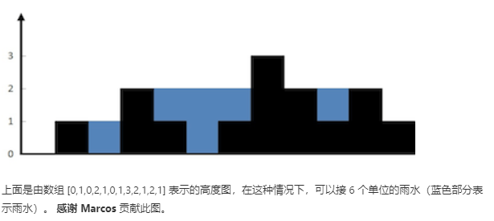

# 4.4 T42接雨水

## 题目描述
给定 n 个非负整数表示每个宽度为 1 的柱子的高度图，计算按此排列的柱子，下雨之后能接多少雨水。

示例:
```
输入: [0,1,0,2,1,0,1,3,2,1,2,1]
输出: 6
```

来源：力扣（LeetCode）
链接：https://leetcode-cn.com/problems/trapping-rain-water
著作权归领扣网络所有。商业转载请联系官方授权，非商业转载请注明出处。

---
使用`height`数组存储柱子的高度。
### 题解1
使用动态规划，`dp[i]`存储到第i个(i从0开始)柱子可以存多少水。动态规划不熟练，写的很麻烦。

自底向上，根据初始状态推导出最终状态。

则初始状态`dp[0]=0;dp[1]=0`

状态转移:
```python
if height[i]<=height[i-1]: 
    dp[i] = dp[i-1]
else:
    H = height[i-1]
    从i-1往左遍历，如果高度大于H就加水，并且更新高度H
    找到第一个不小于height[i]的柱子退出遍历，加水
```
具体python3代码：
```python
class Solution:
    def trap(self, height: [int]) -> int:
        n = len(height)
        if n==0: return 0

        dp = [0]*n
        for i in range(1, n):
            if height[i]<=height[i-1]:
                dp[i] = dp[i-1]
            else:
                j = i-1; up = height[i-1]
                dp[i] = dp[i-1]
                while j>-1 and height[j]<height[i]:
                    if height[j]>up:
                        dp[i] += (height[j]-up)*(i-j-1)
                        up = height[j]
                    j -= 1
                if j>-1:
                    dp[i] += (height[i]-up)*(i-j-1)
        return dp[-1]
```
时间复杂度接近$O(n^2)$，空间复杂度$O(n)$。不大行。执行用时56ms

---
### 题解2
暴力法，对每一个柱子算出它能盛多少水。

基本思路：从左到右遍历一次数组
1. 算出左边柱子最大高度(包含自己) max_left
2. 算出右边柱子最大高度(包含自己) max_right
3. 则该柱子能盛水 min(max_left, max_right)-height[i]

```python
class Solution:
    def trap(self, height):
        water = 0
        for i in range(1, len(height)-1):
            max_left = max(height[:i+1])
            max_right = max(height[i:])
            water += min(max_left, max_right)-height[i]
        return water
```
时间复杂度$O(n^2)$，空间复杂度$O(1)$。经提交发现执行的非常慢2368ms。可能和数组大量复制有关。

**改进**：使用两个数组存储$max\_left_i$和$max\_right_i$，就不用每次都去遍历求左右最大值。

---
### 题解3
使用栈。当访问柱子高度小于栈顶柱子高度就入栈；当高度大于栈顶柱子高度(说明中间有空隙可以盛水)，就退栈并加水。**主要思想和题解1的DP类似**，栈这个更好。

1. 遍历柱子高度数组下标cur
2. 若栈不空 或 height[cur]大于栈顶存储柱子高度
    - 退栈top = stack.pop()
    - 如果栈为空，左侧已经没有比height[top]更高的柱子，无法盛水，退出循环。
    - 获取加水的高度
        min(height[stack[-1]], height[cur]) - height[top]
    - 获取加水宽度
        cur-stack[-1]-1
3. 将cur入栈，并且自加1

```python
import collections
class Solution:
    def trap(self, height):
        stack = collections.deque()
        cur = 0
        water = 0
        while cur<len(height):
            while stack and height[cur]>height[stack[-1]]:
                top = stack.pop()
                if stack:
                    water += (min(height[stack[-1]], height[cur]) - height[top])*(cur-stack[-1]-1)
            stack.append(cur)
            cur += 1
        return water
```
时间复杂度$O(n)$，空间复杂度$O(n)$。执行时间40ms，击败95%python3。