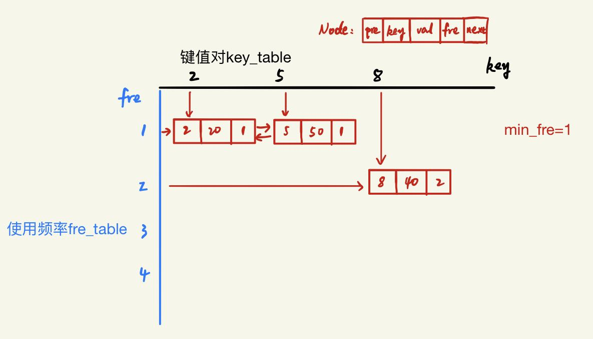

# 4.5 T460FLU缓存

## 题目描述
请你为 最不经常使用（LFU）缓存算法设计并实现数据结构。它应该支持以下操作：get 和 put。

get(key) - 如果键存在于缓存中，则获取键的值（总是正数），否则返回 -1。
put(key, value) - 如果键不存在，请设置或插入值。当缓存达到其容量时，则应该在插入新项之前，使最不经常使用的项无效。在此问题中，当存在平局（即两个或更多个键具有相同使用频率）时，应该去除 最近 最少使用的键。
「项的使用次数」就是自插入该项以来对其调用 get 和 put 函数的次数之和。使用次数会在对应项被移除后置为 0 。

进阶：
你是否可以在 O(1) 时间复杂度内执行两项操作？

示例：
```
LFUCache cache = new LFUCache( 2 /* capacity (缓存容量) */ );

cache.put(1, 1);
cache.put(2, 2);
cache.get(1);       // 返回 1
cache.put(3, 3);    // 去除 key 2
cache.get(2);       // 返回 -1 (未找到key 2)
cache.get(3);       // 返回 3
cache.put(4, 4);    // 去除 key 1
cache.get(1);       // 返回 -1 (未找到 key 1)
cache.get(3);       // 返回 3
cache.get(4);       // 返回 4
```
来源：力扣（LeetCode）
链接：https://leetcode-cn.com/problems/lfu-cache
著作权归领扣网络所有。商业转载请联系官方授权，非商业转载请注明出处。

## 题解1
题目要求简单说就是实现两个功能，添加put()，查找get()。

难点：
1. put()时，若容器已满，则要弹出**使用频率最低**中的**最先被使用的值**。
2. get()时，若容器中存在，则在返回其值的同时，对应的**使用频率要+1**。

如果单纯的用hash表存储键-值，键-频率，那么每次弹出元素时都要查找最不常用的键值对，非常耗时。

这里新建一个节点Node类，存储键对应的各种值，get()操作获取对应node对象的值，put()操作添加node对象新节点。
Node类有属性pre，key，value，fre，next。

再建立两个表和一个存储最小频率的变量
1. 频率表fre_table，键为频率，值为链表。
2. 键值表key_table，键为key，值为node。
3. 存储最小频率。

其中频率表值为一个双向链表，返回head和tail的node节点。
每次新插入节点在头部插入，弹出节点通过tail.pre获取弹出。大致结构如图：




```python
# OK
# 基本思路：
# 建立一个频率表fre_table，键为频率，值为一个双向链表；
# 建立一个键值对表key_table，键为值，值为Node节点

# get(key):
# key在key_table中，则对应node.fre+=1，并且修改其在fre_table中的位置。最后返回node.value

# put(key, value):
# key在key_table中，增加其频率，并更新其值和在fre_table中的位置
# 若不在key_table中，且len(key_table)<capacity，就新建node，并插入fre_table和key_table中
# 若容量达到上限，就删除fre_table[min_fre]中尾节点的上一个节点，并更新min_fre的值

# 难点：min_fre值的更新
# 因为get和put都要“插入”节点，所以在linked_insert中进行判断更新

class Node:
    def __init__(self, key, value, fre=0, pre=None, next=None):
        self.key = key
        self.value = value
        self.fre = fre
        self.pre = pre
        self.next = next

    def insert(self, node):
        node.pre = self
        node.next = self.next
        self.next.pre = node
        self.next = node

def create_doubly_linkedlist():
    head = Node(0, 0)
    tail = Node(0, 0)
    head.next = tail
    tail.pre = head
    return head, tail

import collections

class LFUCache:
    def __init__(self, capacity: int):
        # 建立一个默认字典，值默认为head和tail
        self.fre_table = collections.defaultdict(create_doubly_linkedlist)
        self.min_fre = 0
        self.capacity = capacity
        # 值默认为Node对象
        self.key_table = collections.defaultdict(Node)

    def linked_insert(self, node):
        self.linked_delete(node)
        node.fre += 1
        _, tail = self.fre_table[node.fre]
        tail.pre.insert(node)
        self.key_table[node.key] = node
        if node.fre==1:
            self.min_fre=1
        elif self.min_fre==node.fre-1:
            head, tail = self.fre_table[node.fre-1]
            if head.next == tail:
                self.min_fre = node.fre

    def linked_delete(self, node):
        if node.pre and node.next:
            node.pre.next = node.next
            node.next.pre = node.pre
            if (node.pre, node.next) == self.fre_table[node.fre]:
                self.fre_table.pop(node.fre)
        return node.key

    def get(self, key: int) -> int:
        if key in self.key_table:
            self.linked_insert(self.key_table[key])
            return self.key_table[key].value
        return -1

    def put(self, key: int, value: int) -> None:
        if self.capacity>0:
            if key in self.key_table:
                self.linked_insert(self.key_table[key])
                self.key_table[key].value = value
            else:
                if len(self.key_table)==self.capacity:
                    head, _ = self.fre_table[self.min_fre]
                    popkey = self.linked_delete(head.next)
                    self.key_table.pop(popkey)

                if len(self.key_table)<self.capacity:
                    node = Node(key, value, 0)
                    self.linked_insert(node)

# Your LFUCache object will be instantiated and called as such:
# obj = LFUCache(capacity)
# param_1 = obj.get(key)
# obj.put(key,value)
```

