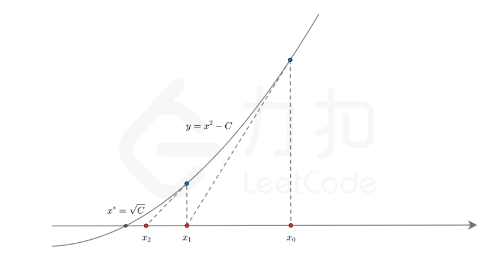

# 5.09 T69.x的平方根

[toc]

## 题目
实现 int sqrt(int x) 函数。
计算并返回 x 的平方根，其中 x 是非负整数。
由于返回类型是整数，结果只保留整数的部分，小数部分将被舍去。

示例 1:
```
输入: 4
输出: 2
```
示例 2:
```
输入: 8
输出: 2
说明: 8 的平方根是 2.82842..., 
     由于返回类型是整数，小数部分将被舍去。
```
来源：力扣（LeetCode）
链接：https://leetcode-cn.com/problems/sqrtx
著作权归领扣网络所有。商业转载请联系官方授权，非商业转载请注明出处。


## 题解
二分

```python
class Solution:
    def mySqrt(self, x: int) -> int:
        left, right = 1, x
        while left<=right:
            mid = (left+right)>>1
            if mid**2>x:
                right = mid-1
            elif mid**2<x:
                left = mid+1
            else:
                return mid
        return right
```
- 执行用时:64 ms, 在所有 Python3 提交中击败了29.70%的用户
- 内存消耗:13.6 MB, 在所有 Python3 提交中击败了6.06%的用户

## 题解2
牛顿迭代，使用切线， $f(x) = x^2 - C$ ，在$(x_0, f(x_0))$处的切线与x轴的交点越来越接近零点。



```python
class Solution:
    def mySqrt(self, x: int) -> int:
        if x==0: return 0

        C = float(x)
        x0 = float(x)
        while True:
            x1 = (x0 + C/x0)/2
            if abs(x1-x0)<1e-8:
                break
            x0 = x1
        return int(x0)
```

- 执行用时 :48 ms, 在所有 Python3 提交中击败了64.24%的用户
- 内存消耗 :13.7 MB, 在所有 Python3 提交中击败了6.06%的用户

