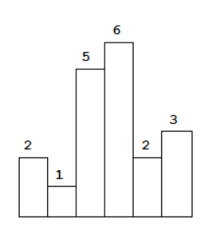
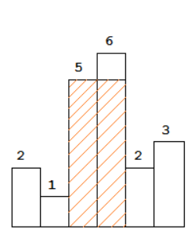

# 5.30 T84.柱状图中最大的矩形

## 题目
给定 n 个非负整数，用来表示柱状图中各个柱子的高度。每个柱子彼此相邻，且宽度为 1 。

求在该柱状图中，能够勾勒出来的矩形的最大面积。


以上是柱状图的示例，其中每个柱子的宽度为 1，给定的高度为 [2,1,5,6,2,3]。


图中阴影部分为所能勾勒出的最大矩形面积，其面积为 10 个单位。

示例:
```
输入: [2,1,5,6,2,3]
输出: 10
```

来源：力扣（LeetCode）
链接：https://leetcode-cn.com/problems/largest-rectangle-in-histogram/
著作权归领扣网络所有。商业转载请联系官方授权，非商业转载请注明出处。


## 题解1
单调栈
维护一个递增的单调栈，记录索引和高度。

```python
class Solution:
    def largestRectangleArea(self, heights: List[int]) -> int:
        stack = []
        n = len(heights)

        res = 0
        for i in range(n):
            while stack and stack[-1][1]>=heights[i]:
                ind, hig = stack.pop()
                tmp = stack[-1][0] if stack else -1
                res = max(res, (i-tmp-1)*hig)
            stack.append((i, heights[i]))
        
        for i in range(len(stack)):
            if i==0:
                left = -1
            else:
                left = stack[i-1][0]
            res = max(res, (stack[-1][0]-left)*stack[i][1])
        return res
```
时间复杂度$O(n)$，空间复杂度$O(n)$。


同上：
```python
class Solution:
    def largestRectangleArea(self, heights: List[int]) -> int:
        n = len(heights)
        left, right = [0] * n, [0] * n

        # 从左到右遍历，找到左边界(左边第一个比它小的索引)
        mono_stack = list()
        for i in range(n):
            while mono_stack and heights[mono_stack[-1]] >= heights[i]:
                mono_stack.pop()
            left[i] = mono_stack[-1] if mono_stack else -1
            mono_stack.append(i)
        
        # 从右到左遍历，找到右边界(右边第一个比它小的索引)
        mono_stack = list()
        for i in range(n - 1, -1, -1):
            while mono_stack and heights[mono_stack[-1]] >= heights[i]:
                mono_stack.pop()
            right[i] = mono_stack[-1] if mono_stack else n
            mono_stack.append(i)
        
        ans = max((right[i] - left[i] - 1) * heights[i] for i in range(n)) if n > 0 else 0
        return ans

# 作者：LeetCode-Solution
# 链接：https://leetcode-cn.com/problems/largest-rectangle-in-histogram/solution/zhu-zhuang-tu-zhong-zui-da-de-ju-xing-by-leetcode-/
# 来源：力扣（LeetCode）
# 著作权归作者所有。商业转载请联系作者获得授权，非商业转载请注明出处。
```
优化：
```python
class Solution:
    def largestRectangleArea(self, heights: List[int]) -> int:
        n = len(heights)
        left, right = [0] * n, [n] * n

        mono_stack = list()
        for i in range(n):
            while mono_stack and heights[mono_stack[-1]] >= heights[i]:
                right[mono_stack[-1]] = i
                mono_stack.pop()
            left[i] = mono_stack[-1] if mono_stack else -1
            mono_stack.append(i)
        
        ans = max((right[i] - left[i] - 1) * heights[i] for i in range(n)) if n > 0 else 0
        return ans

# 作者：LeetCode-Solution
# 链接：https://leetcode-cn.com/problems/largest-rectangle-in-histogram/solution/zhu-zhuang-tu-zhong-zui-da-de-ju-xing-by-leetcode-/
# 来源：力扣（LeetCode）
# 著作权归作者所有。商业转载请联系作者获得授权，非商业转载请注明出处。
```
