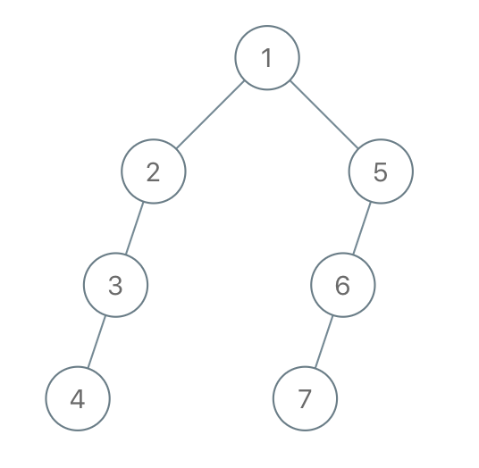

# 6.18 T1028.从先序遍历还原二叉树

## 题目
我们从二叉树的根节点 root 开始进行深度优先搜索。

在遍历中的每个节点处，我们输出 D 条短划线（其中 D 是该节点的深度），然后输出该节点的值。（如果节点的深度为 D，则其直接子节点的深度为 D + 1。根节点的深度为 0）。

如果节点只有一个子节点，那么保证该子节点为左子节点。

给出遍历输出 S，还原树并返回其根节点 root。

示例 1：

输入："1-2--3--4-5--6--7"
输出：[1,2,5,3,4,6,7]


示例 2：

输入："1-2--3---4-5--6---7"
输出：[1,2,5,3,null,6,null,4,null,7]


示例 3：

输入："1-401--349---90--88"
输出：[1,401,null,349,88,90]


提示：
- 原始树中的节点数介于 1 和 1000 之间。
- 每个节点的值介于 1 和 10 ^ 9 之间。

来源：力扣（LeetCode）
链接：https://leetcode-cn.com/problems/recover-a-tree-from-preorder-traversal
著作权归领扣网络所有。商业转载请联系官方授权，非商业转载请注明出处。


## 题解
观察发现，节点只有一个子节点，那么保证该子节点为左子节点。

当左孩子已有时，再出现同深度的就是右孩子节点。

```python
class Solution:
    def recoverFromPreorder(self, S: str) -> TreeNode:
        path, pos = list(), 0
        while pos < len(S):
            level = 0
            while S[pos] == '-':
                level += 1
                pos += 1
            value = 0
            while pos < len(S) and S[pos].isdigit():
                value = value * 10 + (ord(S[pos]) - ord('0'))
                pos += 1
            node = TreeNode(value)
            if level == len(path):
                if path:
                    path[-1].left = node
            else:
                path = path[:level]
                path[-1].right = node
            path.append(node)
        return path[0]

# 作者：LeetCode-Solution
# 链接：https://leetcode-cn.com/problems/recover-a-tree-from-preorder-traversal/solution/cong-xian-xu-bian-li-huan-yuan-er-cha-shu-by-leetc/
# 来源：力扣（LeetCode）
# 著作权归作者所有。商业转载请联系作者获得授权，非商业转载请注明出处。
```

我的思路和官方一样，但是代码可读性差
```python
class Solution:
    def recoverFromPreorder(self, S: str) -> TreeNode:

        path = []
        cnt_, i, num = 0, 0, 0
        n = len(S)

        while i<n:
            if S[i].isdigit():
                num = num*10 + int(S[i])
            else:
                if num>0:
                    node = TreeNode(num)
                    if not path and cnt_==0:
                        path.append([node, True])
                    else:
                        
                        if path[cnt_-1][1]:
                            path[cnt_-1][0].left = node
                            path[cnt_-1][1] = False
                        else:
                            path[cnt_-1][0].right = node

                        if len(path)<cnt_+1:
                            path.append([node, True])
                        else:
                            path[cnt_] = [node, True]
                    # print(num, cnt_, path)
                    # print('---'*10)
                    num = 0
                    cnt_ = 0
                cnt_ += 1

            i += 1

        # print(num, cnt_, len(path))
        if num>0:
            node = TreeNode(num)
            if cnt_==0: return node
            
            if path[cnt_-1][1]:
                path[cnt_-1][0].left = node
            else:
                path[cnt_-1][0].right = node


        # print(path)
        if not path:
            return None
        node = path[0][0]
        return node
```
时间复杂度$O(n)$，字符串长度；
空间复杂度$O(h)$，树的深度。

