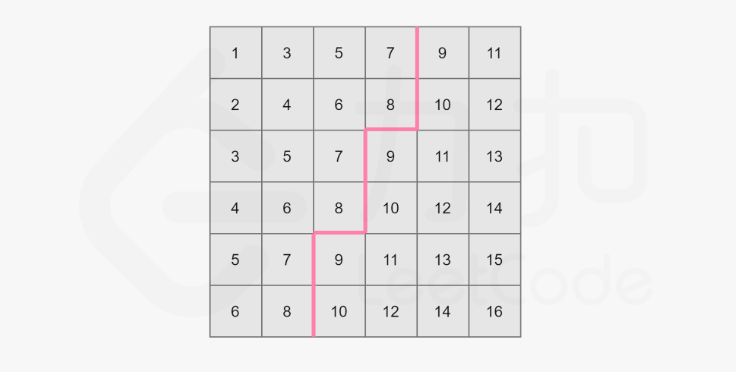

# 7.02 T378.有序矩阵中第K小的元素

## 题目
给定一个 n x n 矩阵，其中每行和每列元素均按升序排序，找到矩阵中第 k 小的元素。
请注意，它是排序后的第 k 小元素，而不是第 k 个不同的元素。

示例：
```
matrix = [
   [ 1,  5,  9],
   [10, 11, 13],
   [12, 13, 15]
],
k = 8,

返回 13。
```

提示：
- 你可以假设 k 的值永远是有效的，1 ≤ k ≤ n2 。

来源：力扣（LeetCode）
链接：https://leetcode-cn.com/problems/kth-smallest-element-in-a-sorted-matrix
著作权归领扣网络所有。商业转载请联系官方授权，非商业转载请注明出处。

## 题解1
暴力+排序

题中说明：矩阵每行从左至右递增，从上至下递增

思路：对可能的值加入队列，然后排序，取出第k小的数

对于`matric[i][j]`，小于等于它的数个数为$(i+1)\times(j+1)$，对应于矩阵左上角区域。
所以对于`matrix[i][:]`，第k小的数只存在于`matrix[i][: k//(i+1)]`中。

```python
class Solution:
    def kthSmallest(self, matrix: List[List[int]], k: int) -> int:
        li = []
        n = len(matrix)

        for i in range(min(k, n)):
            for j in range(min(k//(i+1), n)):
                li.append(matrix[i][j])
        
        li.sort()
        return li[k-1]
```
时间复杂度$O(n^2\log{n})$，空间复杂度$O(n^2)$。leetcode执行时间220ms。


## 题解2
归并+小顶堆

把每行看成是一个升序列，将问题转化为n个有序数组，求第k小的数。
用归并排序，构建小顶堆，归并k次。

```python
class Heap:
    # 为题目建立特定的  小顶堆(堆中元素为序列)
    def __init__(self):
        self.heap = []
    
    def down(self, ind):
        n = len(self.heap)
        while ind*2+1<n:
            l, r = ind*2+1, ind*2+2
            if l==n-1:
                a = l
            else:
                a = l if self.heap[l][0]<self.heap[r][0] else r
            if self.heap[ind][0]<=self.heap[a][0]:
                break
            else:
                self.heap[ind], self.heap[a] = self.heap[a], self.heap[ind]
                ind = a
    
    def up(self, ind):
        while ((ind-1)>>1) >= 0:
            par = (ind-1)>>1
            if self.heap[par][0]<=self.heap[ind][0]:
                break
            else:
                self.heap[par], self.heap[ind] = self.heap[ind], self.heap[par]
                ind = par
    
    def heappush(self, val):
        self.heap.append(val)
        self.up(len(self.heap)-1)
    
    def heappop(self):
        n = len(self.heap)
        if n>0:
            self.heap[0], self.heap[-1] = self.heap[-1], self.heap[0]
            a = self.heap.pop()
            self.down(0)
            return a
        return None


class Solution:
    def kthSmallest(self, matrix: List[List[int]], k: int) -> int:
        heap = Heap()
        n = len(matrix)
        for i in range(n):
            heap.heappush((matrix[i][0], i, 0))
        
        for i in range(k-1):
            val, r, c = heap.heappop()
            if c==n-1:
                continue
            heap.heappush((matrix[r][c+1], r, c+1))
        
        return heap.heappop()[0]
```
时间复杂度$O(k\log{n})$，空间复杂度$O(n)$。leetcode执行时间640ms。

借助python自带小顶堆模块，leetcode执行时间260ms。
```python
import heapq

class Solution:
    def kthSmallest(self, matrix: List[List[int]], k: int) -> int:
        n = len(matrix)
        pq = [(matrix[i][0], i, 0) for i in range(n)]
        heapq.heapify(pq)

        for i in range(k - 1):
            num, x, y = heapq.heappop(pq)
            if y != n - 1:
                heapq.heappush(pq, (matrix[x][y + 1], x, y + 1))
        
        return heapq.heappop(pq)[0]
```

## 题解3
二分

显然`matrix[0][0]`是最小值，`matrix[n-1][n-1]`是最大值，求第k小的值必定在这二者之间，二分。

问题在于如何决定二分的区间？

> `mid = (matrix[0][0] + matrix[n-1][n-1])>>1`，则可在$O(n)$的时间内找到小于等于mid的个数。
1. 从`matrix[n-1][0]`往右找到第一个大于mid的值
2. 然后再往上找到第一个不大于mid的值，再往右。如此循环，直至找到第一行为止。

参考leetcode题解图：


```python
class Solution:
    def kthSmallest(self, matrix: List[List[int]], k: int) -> int:
        n = len(matrix)

        def check(mid):
            cnt = 0
            i, j = n-1, 0
            while i>-1 and j<n:
                if matrix[i][j]<=mid:
                    cnt += (i+1)
                    j += 1
                else:
                    i -= 1
            return cnt<k

        left, right = matrix[0][0], matrix[n-1][n-1]
        while left<right:
            mid = (left+right)>>1
            if check(mid):
                left = mid + 1
            else:
                right = mid
        return right
```
时间复杂度$O(n\log(r-l))$，空间复杂度$O(1)$，$l$和$r$分别为矩阵的最小值和最大值。
leetcode提交192ms，超过99%python3用户。

