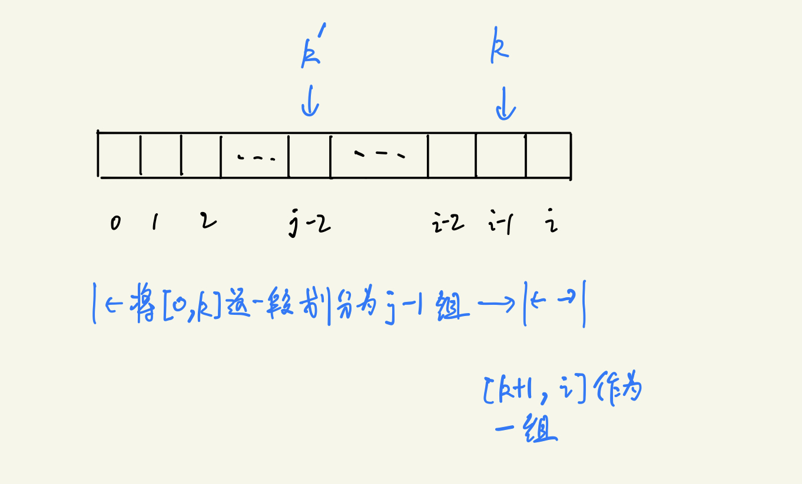

# 7.25 T410.分割数组的最大值

## 题目
给定一个非负整数数组和一个整数 m，你需要将这个数组分成 m 个非空的连续子数组。设计一个算法使得这 m 个子数组各自和的最大值最小。

注意:数组长度 n 满足以下条件:
- 1 ≤ n ≤ 1000
- 1 ≤ m ≤ min(50, n)
示例:
```
输入:
nums = [7,2,5,10,8]
m = 2

输出:
18

解释:
一共有四种方法将nums分割为2个子数组。
其中最好的方式是将其分为[7,2,5] 和 [10,8]，
因为此时这两个子数组各自的和的最大值为18，在所有情况中最小。
```
来源：力扣（LeetCode）
链接：https://leetcode-cn.com/problems/split-array-largest-sum
著作权归领扣网络所有。商业转载请联系官方授权，非商业转载请注明出处。


## 题解1
动态规划

题目意思是针对每一个数组，都有一个划分，在确定划分后，求得每个连续子数组和，再取这个划分下所有连续子数组和的最大值。然后，针对每一个划分，都有一个数组和的最大值，最后结果就是这一系列数的最小值。

为方便理解，用符号标记说明。
- 假设数组为 $nums$ ，将其划分为 $m$ 个连续子数组，设它满足条件的划分方案数有 $K$ 种。

对于第 $i$ 种划分方案，将数组 $nums$ 划分为 $m$ 个连续子数组 $arr_{i_1}, arr_{i_2}, ..., arr_{i_m}$，
得到最大连续数组和为 $a_i = \max_{j=1}^m (sum(arr_{i_j}))$。

则最终答案为
\[ res = \min_{i=1}^K a_i \]

接下来使用动态规划解决，设`f[i][j]`为将数组`nums[:i+1]`划分为`j`个连续子数组的结果。则最终结果为`f[n-1][m]; n = len(nums)`

状态转移：$f[i][j] = \min_{k=j-2}^{i-1}( \max(f[k][j-1], sum(nums[k+1:i+1])\ )\ )$


从`j-2`到`i-1`枚举`k`，将`[0, k]`范围的数组划分为`j-1`组，将`[k+1, i]`划分为一组，得到该划分情况下和的最大值，再取所有情况的最小值即为`f[i][j]`。

python3代码：
```python
class Solution:
    def splitArray(self, nums: List[int], m: int) -> int:
        n = len(nums)
        if m>=n: return max(nums)

        # 建立前缀数组，方便求连续子数组和
        pre = [0]*n
        for i in range(n):
            pre[i] = pre[i-1] + nums[i]

        INF = 1<<31
        f = [[INF]*(m+1) for _ in range(n)]

        for i in range(n):
            for j in range(1, min(i+1, m)+1):
                if j==1:
                    f[i][j] = pre[i]
                    continue

                for k in range(i-1, j-3, -1):
                    f[i][j] = min(f[i][j], max(f[k][j-1], pre[i]-pre[k]))

        return f[-1][-1]
```
时间复杂度$O(n^2 m)$，空间复杂度$O(mn)$。


## 题解2
二分

题目目标是，找到所有满足要求的划分情况中的最大连续子数组和的最小值。

贪心模拟划分情况，在区间`[max(nums), sum(nums)]`中二分查找连续子数组和的最大值。若在该值下，数组划分为连续子数组个数大于`m`时，说明该值偏小，在右区间查找；若个数小于`m`，则说明该值偏大，在左区间查找。

```python
class Solution:
    def splitArray(self, nums: List[int], m: int) -> int:

        # 模拟数组划分，当最大子数组和不超过x时，返回可以划分的子数组个数
        def split_arr(x):
            cnt = 1; pre = 0
            for v in nums:
                if pre + v > x:
                    cnt += 1
                    pre = v
                else:
                    pre += v
            return cnt

        left, right = max(nums), sum(nums)
        while left<right:
            mid = ((right-left)>>1) + left
            temp = split_arr(mid)
            if temp<=m:
                right = mid
            else:
                left = mid + 1
        return left
```
时间复杂度$O(n \ \log{(sum(nums)-\max(nums))}\ )$